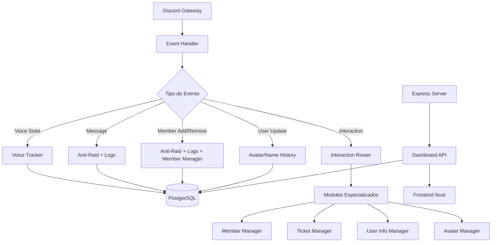
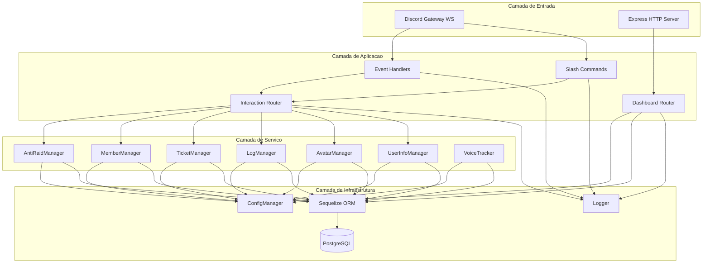
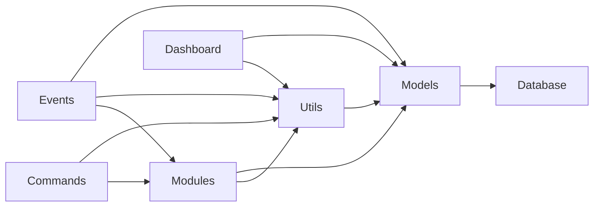
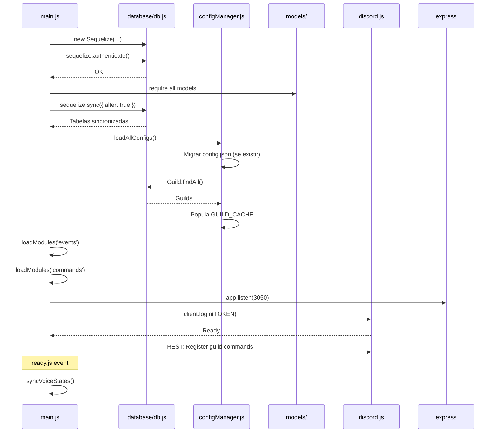
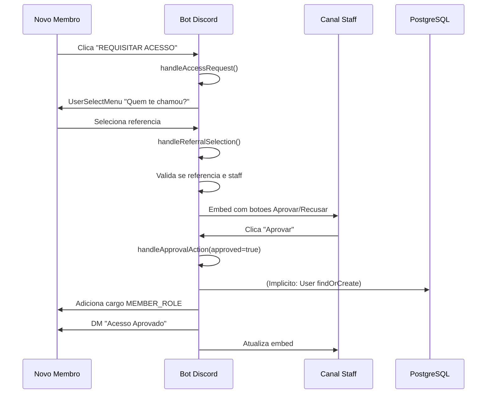
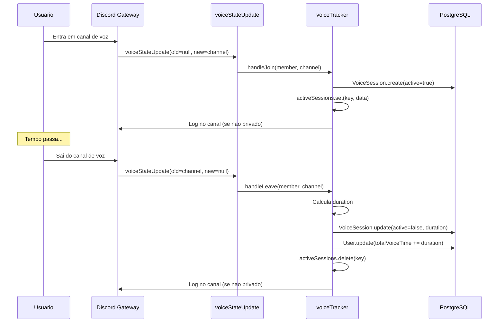
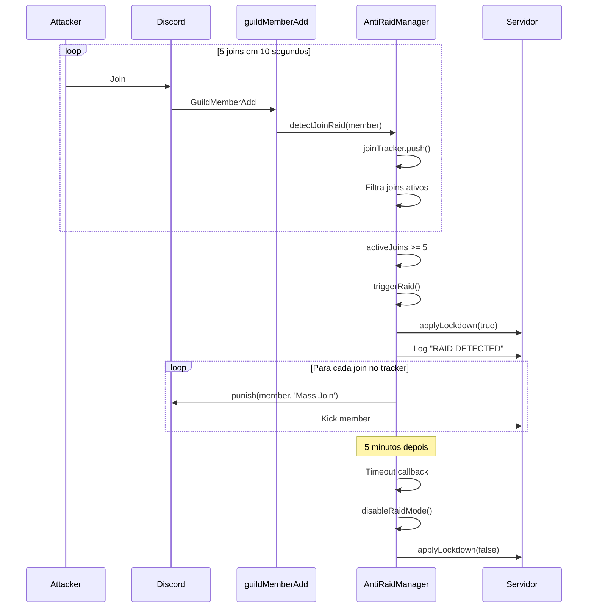
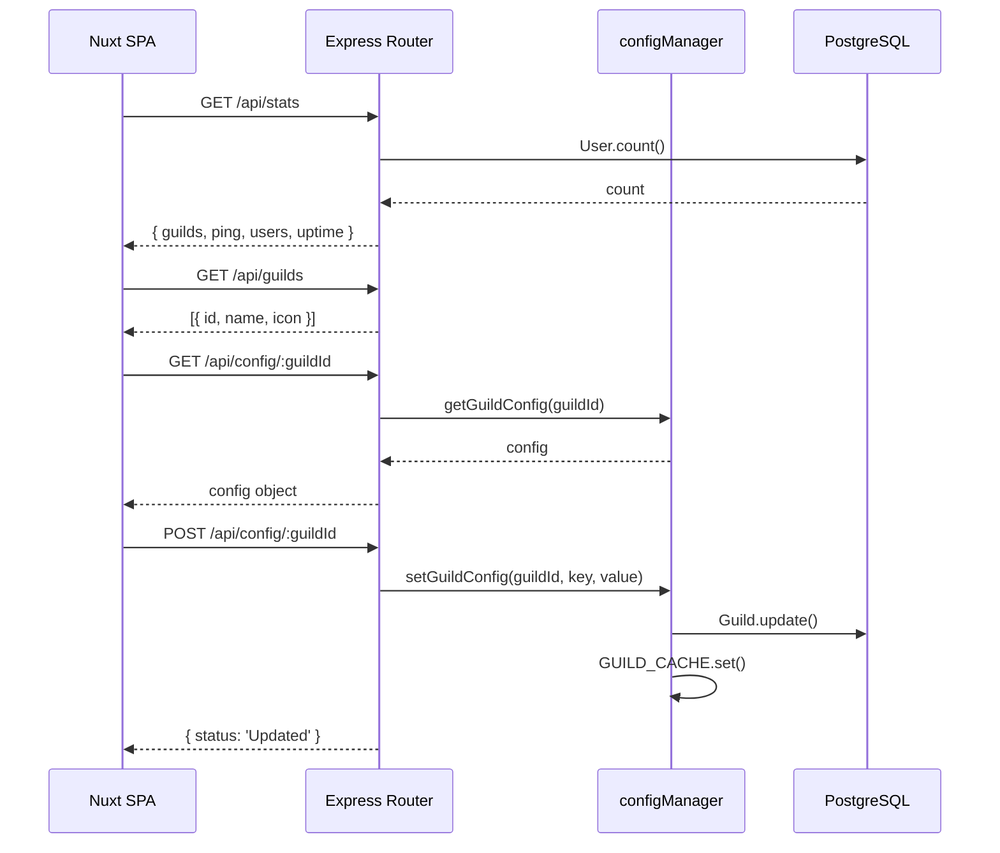
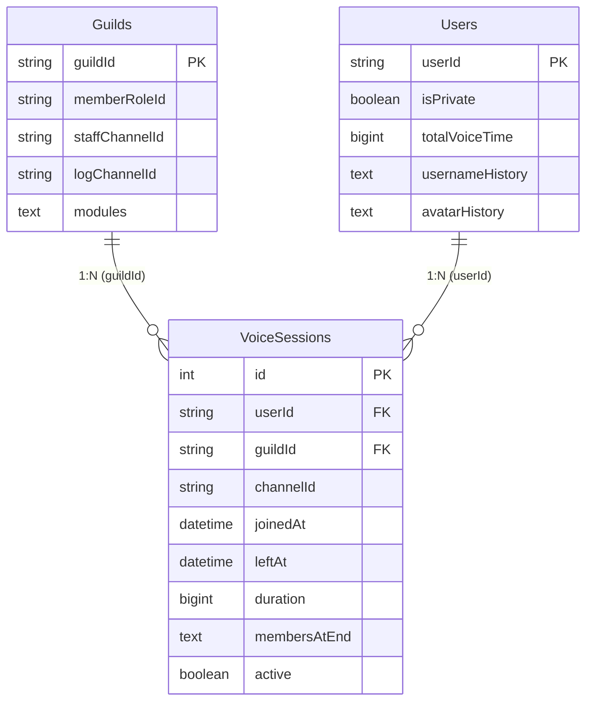
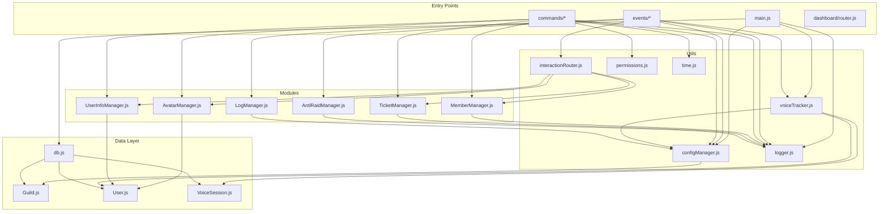

# Documentacao Tecnica Completa - Discord Bot de Gerenciamento

---

# 1. Visao Geral do Projeto

## Objetivo Principal

Sistema de bot para Discord projetado para gerenciamento completo de servidores (guilds), com foco em:

- Controle de acesso e verificacao de membros
- Rastreamento de atividade em canais de voz
- Sistema de tickets de suporte
- Protecao anti-raid
- Logs detalhados de eventos
- Monitoramento especifico de usuarios
- Dashboard web para administracao remota

## Problema que Resolve

Automatiza tarefas administrativas em servidores Discord de medio a grande porte, eliminando a necessidade de moderacao manual constante para:

- Verificacao de novos membros atraves de sistema de aprovacao por staff
- Registro e analise de tempo em canais de voz
- Historico de mudancas de avatar e username
- Deteccao e resposta automatica a raids
- Gerenciamento de tickets de suporte
- Monitoramento de usuarios especificos (funcionalidade dedicada)

## Casos de Uso

1. **Onboarding de Membros**: Novos membros solicitam acesso, indicam quem os convidou, e staff aprova/recusa
2. **Tracking de Voz**: Registro automatico de todas as sessoes de voz com duracao, participantes e historico
3. **Anti-Raid**: Deteccao automatica de joins em massa, spam e mencoes excessivas com resposta automatizada
4. **Tickets**: Sistema de suporte privado entre membros e staff
5. **Logs**: Registro de edicoes/delecoes de mensagens, mudancas de cargo, entrada/saida de membros
6. **Dashboard**: Interface web para configuracao remota e monitoramento em tempo real

## Fluxo Geral de Funcionamento



---

# 2. Estrutura de Diretorios

```
/
├── config.json                 # Configuracao legada (migrada para DB na inicializacao)
├── docker-compose.yml          # Orquestracao de containers (bot + PostgreSQL)
├── Dockerfile                  # Build da imagem Docker
├── .dockerignore               # Ignorados no build Docker
├── dump.sql                    # Dump completo do banco de dados
├── .env                        # Variaveis de ambiente
├── postgresql.conf             # Configuracao personalizada do PostgreSQL
├── package.json                # Dependencias do backend
├── package-lock.json           # Lock de dependencias
│
├── src/
│   ├── main.js                 # Ponto de entrada principal
│   ├── aaa.gif                 # Imagem para painel de verificacao
│   ├── .env                    # Env alternativo (legado)
│   │
│   ├── commands/               # Comandos slash do Discord
│   │   ├── admin.js            # Comandos administrativos (ban, kick, mute, warn)
│   │   ├── clearuser.js        # Limpeza de mensagens por usuario
│   │   ├── help.js             # Manual de comandos
│   │   ├── info.js             # Estatisticas do servidor
│   │   ├── lastcall.js         # Ultima sessao de voz
│   │   ├── lockdown.js         # Atribuicao em massa de cargo
│   │   ├── modulos.js          # Gerenciamento de modulos ativos
│   │   ├── names.js            # Historico de usernames
│   │   ├── nuke.js             # Destruicao e recriacao de canal
│   │   ├── owner.js            # Comandos exclusivos do dono
│   │   ├── privacy.js          # Controle de privacidade do usuario
│   │   ├── raidmode.js         # Controle manual de raid mode
│   │   ├── setup-frin.js       # Configuracao de monitoramento especifico
│   │   ├── setup.js            # Setup automatico de sistemas
│   │   ├── stats.js            # Ranking de tempo em voz
│   │   ├── ticket.js           # Postagem de painel de tickets
│   │   ├── userinfo.js         # Ficha tatica de usuario
│   │   ├── v.js                # Painel de verificacao
│   │   └── voicehistory.js     # Historico de sessoes de voz
│   │
│   ├── events/                 # Event handlers do Discord
│   │   ├── guildMemberAdd.js
│   │   ├── guildMemberRemove.js
│   │   ├── guildMemberUpdate.js
│   │   ├── interactionCreate.js
│   │   ├── messageCreate.js
│   │   ├── messageDelete.js
│   │   ├── messageUpdate.js
│   │   ├── presenceUpdate.js
│   │   ├── ready.js
│   │   ├── userUpdate.js
│   │   └── voiceStateUpdate.js
│   │
│   ├── modules/                # Logica de negocio especializada
│   │   ├── AntiRaidManager.js
│   │   ├── AvatarManager.js
│   │   ├── LogManager.js
│   │   ├── MemberManager.js
│   │   ├── TicketManager.js
│   │   └── UserInfoManager.js
│   │
│   ├── models/                 # Modelos Sequelize
│   │   ├── index.js
│   │   ├── Guild.js
│   │   ├── User.js
│   │   └── VoiceSession.js
│   │
│   ├── database/
│   │   └── db.js               # Conexao Sequelize
│   │
│   ├── utils/                  # Utilitarios
│   │   ├── configManager.js    # Gerenciamento de configuracoes por guild
│   │   ├── interactionRouter.js # Roteamento de interacoes
│   │   ├── logger.js           # Sistema de logs
│   │   ├── permissions.js      # Controle de permissoes (owner)
│   │   ├── time.js             # Formatacao de tempo
│   │   └── voiceTracker.js     # Rastreamento de sessoes de voz
│   │
│   └── dashboard/              # Dashboard web legado
│       ├── router.js           # Rotas Express
│       ├── server.js           # Servidor standalone (nao utilizado)
│       └── public/             # Frontend estatico legado
│           ├── index.html
│           ├── app.js
│           └── style.css
│
└── frontend/                   # Frontend Nuxt 3 (SPA)
    ├── nuxt.config.ts
    ├── package.json
    ├── app.vue
    ├── assets/
    │   └── style.css
    ├── components/
    │   ├── DashboardSidebar.vue
    │   └── StatsCards.vue
    ├── composables/
    │   └── useBot.ts
    └── pages/
        ├── index.vue           # Dashboard principal
        ├── configs.vue         # Configuracao de guilds
        └── messages.vue        # Monitoramento de mensagens
```

## Responsabilidades por Diretorio

### `/src/commands/`
Contem todos os comandos slash do Discord. Cada arquivo exporta um objeto com `data` (SlashCommandBuilder) e `execute` (funcao assincrona). Carregados dinamicamente pelo `main.js`.

### `/src/events/`
Handlers de eventos do Discord Gateway. Cada arquivo exporta `name`, `once` (opcional) e `execute`. Registrados via `client.on()` ou `client.once()`.

### `/src/modules/`
Logica de negocio de alto nivel. Cada modulo encapsula funcionalidades especificas (tickets, anti-raid, member management). Sao chamados pelos event handlers e comandos.

### `/src/models/`
Definicoes de modelos Sequelize para persistencia no PostgreSQL. Cada modelo mapeia uma tabela do banco.

### `/src/utils/`
Funcoes auxiliares reutilizaveis: gerenciamento de configuracoes, roteamento de interacoes, logging, permissoes, formatacao de tempo e tracking de voz.

### `/src/dashboard/`
API REST Express que serve tanto o dashboard web legado (HTML estatico) quanto a API consumida pelo frontend Nuxt.

### `/frontend/`
Aplicacao Nuxt 3 em modo SPA (ssr: false) que consome a API do dashboard. Gerada estaticamente via `nuxt generate` e servida como arquivos estaticos.

---

# 3. Arquitetura do Sistema

## Arquitetura Utilizada

**Arquitetura em Camadas com Event-Driven Pattern**

O sistema utiliza uma arquitetura hibrida combinando:

1. **Event-Driven Architecture**: O bot reage a eventos do Discord Gateway
2. **Service Layer**: Modulos especializados encapsulam logica de negocio
3. **Repository Pattern**: Modelos Sequelize abstraem persistencia
4. **MVC Adaptado**: Commands sao Controllers, Modules sao Services, Models sao Models

## Camadas do Sistema



## Fluxo de Dados

### Fluxo de Eventos Discord

1. **Entrada**: Discord Gateway envia evento via WebSocket
2. **Parsing**: discord.js parseia e emite evento no client
3. **Roteamento**: Event handler correspondente e executado
4. **Processamento**: Handler delega para modulos especializados
5. **Persistencia**: Dados sao salvos via Sequelize no PostgreSQL
6. **Resposta**: Embeds/mensagens sao enviadas de volta ao Discord

### Fluxo de Dados Dashboard

1. **Entrada**: Frontend faz requisicao HTTP para `/api/*`
2. **Roteamento**: Express router direciona para handler
3. **Processamento**: Handler consulta/modifica dados
4. **Persistencia**: Operacoes no banco via Sequelize
5. **Resposta**: JSON retornado ao frontend

## Padroes Utilizados

### 1. Dynamic Module Loading
```javascript
// main.js - Carregamento dinamico de comandos e eventos
function loadModules(dir, collection, isEvent = false) {
  const files = fs.readdirSync(absolutePath).filter(file => file.endsWith('.js'));
  for (const file of files) {
    const module = require(path.join(absolutePath, file));
    // Registro dinamico based no tipo
  }
}
```

### 2. Configuration Cache Pattern
```javascript
// configManager.js - Cache em memoria com sincronizacao DB
let GUILD_CACHE = new Map();

function getGuildConfig(guildId) {
  return GUILD_CACHE.get(guildId) || defaultConfig;
}

async function setGuildConfig(guildId, key, value) {
  await db.update(...);
  GUILD_CACHE.set(guildId, updatedConfig);
}
```

### 3. Interaction Router Pattern
```javascript
// interactionRouter.js - Dispatch centralizado
async function dispatch(interaction, client) {
  if (interaction.isButton()) {
    if (customId === 'request_access') return handleAccessRequest(...);
    if (customId.startsWith('approve_')) return handleApprovalAction(...);
  }
}
```

### 4. Resilient Voice Tracking
```javascript
// voiceTracker.js - Criacao imediata no DB para crash resilience
async function handleJoin(member, channel, client) {
  // Cria registro IMEDIATAMENTE no DB
  const dbSession = await VoiceSession.create({...});
  // Mantem referencia em memoria para atualizacao posterior
  activeSessions.set(sessionKey, { dbId: dbSession.id, ... });
}
```

## Dependencias entre Camadas



---

# 4. Dependencias e Tecnologias

## Linguagens

| Linguagem | Versao | Finalidade |
|-----------|--------|------------|
| Node.js | 22.x (Docker) | Runtime principal |
| JavaScript | ES2022 | Backend (CommonJS) |
| TypeScript | 5.x | Frontend Nuxt |
| Vue.js | 3.x | Framework frontend |
| SQL | - | Queries PostgreSQL |

## Frameworks e Bibliotecas

### Backend

| Pacote | Versao | Finalidade | Onde e Usado |
|--------|--------|------------|--------------|
| `discord.js` | ^14.11.0 | API Discord | `main.js`, todos os commands/events |
| `sequelize` | ^6.37.7 | ORM | `database/db.js`, todos os models |
| `pg` | ^8.11.0 | Driver PostgreSQL | Implicito via Sequelize |
| `pg-hstore` | ^2.3.4 | Pacote hstore para Postgres | Implicito via Sequelize |
| `express` | ^5.2.1 | Servidor HTTP | `main.js`, `dashboard/router.js` |
| `dotenv` | ^16.6.1 | Variaveis de ambiente | `main.js`, `database/db.js` |
| `ms` | ^2.1.3 | Parsing de tempo | `dashboard/router.js`, `utils/time.js` |
| `axios` | ^1.13.5 | HTTP client | Declarado mas nao utilizado |
| `@google/generative-ai` | ^0.24.1 | Google AI | Declarado mas nao utilizado |

### Frontend

| Pacote | Versao | Finalidade |
|--------|--------|------------|
| `nuxt` | latest | Framework Vue SSR/SPA |
| `vue` | latest | Framework reativo |
| `vue-router` | latest | Roteamento SPA |

## Ferramentas

| Ferramenta | Finalidade |
|------------|------------|
| Docker | Containerizacao |
| Docker Compose | Orquestracao multi-container |
| PostgreSQL 16 | Banco de dados relacional |
| nodemon | Hot reload em desenvolvimento |

## Servicos Externos

| Servico | Finalidade | Impacto |
|---------|------------|---------|
| Discord API | Comunicacao com plataforma | Critico - sem ele o bot nao funciona |
| Discord CDN | Avatares e imagens | Baixo - fallback para placeholders |

---

# 5. Documentacao Arquivo por Arquivo

---

## `src/main.js`

### Caminho
`/src/main.js`

### Responsabilidade
Ponto de entrada principal da aplicacao. Inicializa o client Discord, carrega configuracoes, registra comandos/eventos, inicia servidor web e faz login no Discord.

### Dependencias
```javascript
require('dotenv').config();
const { Client, GatewayIntentBits, Collection } = require('discord.js');
const fs = require('fs');
const path = require('path');
const { log } = require('./utils/logger');
const { sequelize: db } = require('./database/db');
const express = require('express');
const dashboardRouter = require('./dashboard/router');
```

### Exportacoes
Nenhuma (modulo de execucao direta)

### Fluxo Interno

1. **Configuracao do Client Discord** (linhas 11-21):
   - Cria instancia do Client com intents especificos:
     - `Guilds`: Eventos de guild
     - `GuildMembers`: Entrada/saida/atualizacao de membros
     - `GuildMessages`: Mensagens em guilds
     - `MessageContent`: Conteudo de mensagens (privilegiado)
     - `GuildVoiceStates`: Estados de voz
     - `GuildModeration`: Acoes de moderacao
     - `GuildPresences`: Status/presenca (privilegiado)

2. **Inicializacao de Collections** (linhas 24-25):
   - `client.commands`: Collection para comandos slash
   - `client.events`: Collection para eventos

3. **Funcao `loadModules`** (linhas 30-61):
   - Carrega dinamicamente arquivos `.js` de um diretorio
   - Para eventos: registra com `client.on()` ou `client.once()`
   - Para comandos: adiciona a `client.commands` collection
   - Trata erros individualmente para nao quebrar o carregamento

4. **Funcao `init`** (linhas 63-136):
   - **Passo 1 - Database**:
     - Autentica conexao Sequelize
     - Carrega todos os models da pasta `models/`
     - Sincroniza schema com `{ alter: true }` (cria/altera tabelas)
     - Executa `loadAllConfigs()` para migrar `config.json` e popular cache
   
   - **Passo 2 - Modules**:
     - Carrega eventos de `src/events/`
     - Carrega comandos de `src/commands/`
   
   - **Passo 3 - Servidor Web**:
     - Cria app Express
     - Rota `/health`: Health check (retorna "OK")
     - Rota `/api/*`: Dashboard router
     - Rota `/`: Serve frontend estatico (Nuxt gerado)
     - Rota `/dashboard`: Redirect para `/`
     - Escuta na porta `PORT` ou 3050
   
   - **Passo 4 - Login**:
     - Faz login com `DISCORD_TOKEN`
     - Registra comandos slash em cada guild (guild commands para atualizacao instantanea)
     - Trata erros de login com `process.exit(1)`

### Funcoes

#### `loadModules(dir, collection, isEvent = false)`
- **Parametros**:
  - `dir` (string): Diretorio relativo a `__dirname`
  - `collection` (Collection): Collection do Discord.js para armazenar
  - `isEvent` (boolean): Se true, carrega como evento; se false, como comando
- **Retorno**: void
- **Regras**:
  - Ignora arquivos que nao terminam em `.js`
  - Eventos com `module.once = true` usam `client.once()`, demais usam `client.on()`
  - Comandos devem ter `module.data.name` ou `module.name`
  - Erros sao logados mas nao interrompem o carregamento

#### `init()`
- **Parametros**: Nenhum
- **Retorno**: Promise<void>
- **Regras**:
  - Sincronizacao do banco com `alter: true` (cuidado em producao)
  - Migracao de `config.json` para DB e automatica
  - Comandos sao registrados por guild (nao global) para atualizacao instantanea
  - Falha no login causa exit do processo

---

## `src/database/db.js`

### Caminho
`/src/database/db.js`

### Responsabilidade
Configura e exporta a instancia Sequelize para conexao com PostgreSQL.

### Dependencias
```javascript
const { Sequelize } = require('sequelize');
require('dotenv').config();
```

### Exportacoes
```javascript
module.exports = { sequelize, connectDB };
```

### Fluxo Interno

1. **Criacao da Instancia Sequelize** (linhas 4-16):
   - Usa variaveis de ambiente: `DB_NAME`, `DB_USER`, `DB_PASS`, `DB_HOST`
   - Dialeto: `postgres`
   - Logging SQL desativado (`logging: false`)
   - Timestamps automaticos (`createdAt`, `updatedAt`)

2. **Funcao `connectDB`** (linhas 18-28):
   - Testa conexao com `sequelize.authenticate()`
   - Em sucesso: loga mensagem
   - Em falha: loga erro e faz `process.exit(1)`
   - **Nota**: Esta funcao nao e mais usada diretamente; `main.js` usa `sequelize.authenticate()` diretamente

---

## `src/models/Guild.js`

### Caminho
`/src/models/Guild.js`

### Responsabilidade
Define o modelo Sequelize para a tabela `Guilds`, armazenando configuracoes por servidor.

### Dependencias
```javascript
const { DataTypes } = require('sequelize');
const { sequelize } = require('../database/db');
```

### Exportacoes
```javascript
module.exports = Guild;
```

### Estrutura da Tabela

| Campo | Tipo | AllowNull | Default | Descricao |
|-------|------|-----------|---------|-----------|
| `guildId` | STRING | false | - | PK, ID do servidor Discord |
| `prefix` | STRING | true | `'!'` | Prefixo de comandos (legado) |
| `memberRoleId` | STRING | true | null | Cargo de membro verificado |
| `staffChannelId` | STRING | true | null | Canal de staff para aprovacoes |
| `welcomeChannelId` | STRING | true | null | Canal de boas-vindas |
| `logChannelId` | STRING | true | null | Canal de logs |
| `adminRoleId` | STRING | true | null | Cargo de administrador |
| `staffRoleId` | STRING | true | null | Cargo de staff |
| `ticketCategoryId` | STRING | true | null | Categoria de tickets |
| `frinMonitorChannelId` | STRING | true | null | Canal de monitoramento especifico |
| `modules` | TEXT('long') | true | JSON string | Modulos ativos (JSON) |
| `webhookUrl` | STRING | true | null | Webhook para logs externos |
| `premium` | BOOLEAN | true | false | Status premium |
| `trackMute` | BOOLEAN | true | false | Rastrear mutes em voz |
| `trackDeaf` | BOOLEAN | true | false | Rastrear deafs em voz |
| `createdAt` | DATETIME | false | auto | Timestamp de criacao |
| `updatedAt` | DATETIME | false | auto | Timestamp de atualizacao |

### Logica Interna
- `guildId` e Primary Key e Unique
- `modules` armazena JSON stringificado: `{"antiraid":true,"logs":true,"tickets":true}`
- Timestamps sao gerenciados automaticamente pelo Sequelize

---

## `src/models/User.js`

### Caminho
`/src/models/User.js`

### Responsabilidade
Define o modelo Sequelize para a tabela `Users`, armazenando dados de usuarios rastreados.

### Dependencias
```javascript
const { DataTypes } = require('sequelize');
const { sequelize } = require('../database/db');
```

### Exportacoes
```javascript
module.exports = User;
```

### Estrutura da Tabela

| Campo | Tipo | AllowNull | Default | Descricao |
|-------|------|-----------|---------|-----------|
| `userId` | STRING | false | - | PK, ID do usuario Discord |
| `isPrivate` | BOOLEAN | true | false | Modo privacidade |
| `totalVoiceTime` | BIGINT | true | 0 | Tempo total em voz (ms) |
| `premium` | BOOLEAN | true | false | Status premium |
| `usernameHistory` | TEXT('long') | true | `'[]'` | Historico de usernames (JSON) |
| `avatarHistory` | TEXT('long') | true | `'[]'` | Historico de avatares (JSON) |
| `lastSeen` | DATETIME | true | NOW | Ultima vez visto |
| `createdAt` | DATETIME | false | auto | Timestamp de criacao |
| `updatedAt` | DATETIME | false | auto | Timestamp de atualizacao |

### Logica Interna
- `usernameHistory` e `avatarHistory` sao JSON stringificado de arrays
- Formato `usernameHistory`: `[{"name":"oldname","date":"2024-01-01T00:00:00Z"}]`
- Formato `avatarHistory`: `[{"url":"https://...","date":"2024-01-01T00:00:00Z"}]`
- `totalVoiceTime` acumula milissegundos de todas as sessoes de voz

---

## `src/models/VoiceSession.js`

### Caminho
`/src/models/VoiceSession.js`

### Responsabilidade
Define o modelo Sequelize para a tabela `VoiceSessions`, armazenando sessoes individuais de voz.

### Dependencias
```javascript
const { DataTypes } = require('sequelize');
const { sequelize } = require('../database/db');
```

### Exportacoes
```javascript
module.exports = VoiceSession;
```

### Estrutura da Tabela

| Campo | Tipo | AllowNull | Default | Descricao |
|-------|------|-----------|---------|-----------|
| `id` | INTEGER | false | AUTO_INCREMENT | PK |
| `userId` | STRING | false | - | ID do usuario (indexado) |
| `guildId` | STRING | false | - | ID do servidor (indexado) |
| `guildName` | STRING | true | null | Nome do servidor |
| `channelId` | STRING | false | - | ID do canal |
| `channelName` | STRING | false | - | Nome do canal |
| `joinedAt` | DATETIME | false | - | Data de entrada |
| `leftAt` | DATETIME | true | null | Data de saida |
| `duration` | BIGINT | true | 0 | Duracao em ms |
| `membersAtEnd` | TEXT | true | null | Membros presentes no fim (JSON) |
| `active` | BOOLEAN | true | true | Se sessao esta ativa |
| `createdAt` | DATETIME | false | auto | Timestamp de criacao |
| `updatedAt` | DATETIME | false | auto | Timestamp de atualizacao |

### Indices
```javascript
indexes: [
  { fields: ['userId', 'joinedAt'] },
  { fields: ['guildId', 'duration'] }
]
```

### Logica Interna
- `membersAtEnd` tem getter/setter customizado para parsear JSON automaticamente:
  ```javascript
  get() { return rawValue ? JSON.parse(rawValue) : []; }
  set(value) { this.setDataValue('membersAtEnd', JSON.stringify(value)); }
  ```
- `active = true` indica sessao em andamento
- `duration` e calculado quando a sessao e fechada (`leftAt - joinedAt`)

---

## `src/utils/configManager.js`

### Caminho
`/src/utils/configManager.js`

### Responsabilidade
Gerencia configuracoes por guild com cache em memoria e persistencia no banco. Realiza migracao one-time de `config.json` para o banco.

### Dependencias
```javascript
const { Guild } = require('../models');
const { log } = require('./logger');
const fs = require('fs');
const path = require('path');
```

### Exportacoes
```javascript
module.exports = {
  getGuildConfig,
  setGuildConfig,
  loadAllConfigs,
  GUILD_CACHE
};
```

### Fluxo Interno

#### `loadAllConfigs()`
1. **Migracao de config.json** (linhas 16-61):
   - Verifica se `config.json` existe na raiz
   - Le e parseia o JSON
   - Para cada guild em `data.guilds`:
     - Usa `findOrCreate` para criar registro no DB se nao existir
     - Mapeia campos legacy (UPPER_CASE) para campos DB (camelCase)
   - Renomeia `config.json` para `config.json.bak` (com fallback para copy+unlink)

2. **Carregamento do DB** (linhas 64-87):
   - Busca todos os registros da tabela `Guilds`
   - Limpa e popula `GUILD_CACHE`
   - Para cada guild, cria objeto com ambos formatos (legacy e novo):
     ```javascript
     {
       ...config,
       MEMBER_ROLE_ID: g.memberRoleId,
       memberRoleId: g.memberRoleId,
     }
     ```

#### `getGuildConfig(guildId)`
- Retorna config do cache ou objeto default se nao encontrado
- **Sincrono**: Nao faz query ao DB, apenas leitura do Map

#### `setGuildConfig(guildId, key, value)`
1. Usa `findOrCreate` para garantir que o registro existe
2. Mapeia chaves legacy para campos DB:
   ```javascript
   const mapping = {
     'MEMBER_ROLE_ID': 'memberRoleId',
     'STAFF_CHANNEL_ID': 'staffChannelId',
   };
   ```
3. Se `key === 'modules'`, stringifica o valor
4. Atualiza no DB com `g.update()`
5. Atualiza cache com objeto completo

---

## `src/utils/interactionRouter.js`

### Caminho
`/src/utils/interactionRouter.js`

### Responsabilidade
Roteador central para interacoes do Discord (botoes, select menus, modais). Dispatch para o modulo apropriado baseado no `customId`.

### Dependencias
```javascript
const { getGuildConfig } = require('./configManager');
const { handleAccessRequest, handleReferralSelection, handleApprovalAction } = require('../modules/MemberManager');
const { handleAvatarHistory } = require('../modules/AvatarManager');
const { handleUserInfoBack } = require('../modules/UserInfoManager');
const { handleTicketOpen, handleTicketCloseRequest, handleTicketCloseConfirm } = require('../modules/TicketManager');
const { log } = require('./logger');
```

### Exportacoes
```javascript
module.exports = { dispatch };
```

### Fluxo Interno

#### `dispatch(interaction, client)`

**1. Button Handling** (`interaction.isButton()`):

| customId | Acao | Modulo |
|----------|------|--------|
| `request_access` | Solicitacao de acesso | MemberManager |
| `approve_{userId}` | Aprovar membro | MemberManager |
| `reject_{userId}` | Rejeitar membro | MemberManager |
| `ticket_open` | Abrir ticket | TicketManager |
| `ticket_close` | Fechar ticket (confirmacao) | TicketManager |
| `ticket_close_confirm` | Confirmar fechamento | TicketManager |
| `avatar_{userId}_{page}` | Historico de avatares | AvatarManager |
| `userinfo_back_{userId}` | Voltar para userinfo | UserInfoManager |

**2. User Select Menu** (`interaction.isUserSelectMenu()`):

| customId | Acao | Modulo |
|----------|------|--------|
| `referral_select` | Selecionar quem indicou | MemberManager |

**3. Modal Submit** (`interaction.isModalSubmit()`):
- Apenas loga como unhandled (nenhum modal implementado)

---

## `src/utils/voiceTracker.js`

### Caminho
`/src/utils/voiceTracker.js`

### Responsabilidade
Rastreia sessoes de voz em tempo real, persistindo no DB e acumulando tempo total por usuario.

### Dependencias
```javascript
const VoiceSession = require('../models/VoiceSession');
const User = require('../models/User');
const { sequelize } = require('../database/db');
const { getGuildConfig } = require('../utils/configManager');
const { EmbedBuilder } = require('discord.js');
const { log } = require('./logger');
```

### Exportacoes
```javascript
module.exports = {
  activeSessions,
  handleJoin,
  handleLeave,
  syncVoiceStates
};
```

### Estado Interno
```javascript
const activeSessions = new Map();
// Key: "{userId}-{guildId}"
// Value: { dbId, userId, guildId, joinedAt }
```

### Fluxo Interno

#### `handleJoin(member, channel, client)`
1. **Cleanup**: Se ja existe sessao ativa para `userId-guildId`, encerra a anterior
2. **Cria usuario**: `User.findOrCreate` para garantir registro
3. **Cria sessao no DB IMEDIATAMENTE** (crash resilience):
   ```javascript
   const dbSession = await VoiceSession.create({
     userId, guildId, guildName, channelId, channelName, joinedAt: now, active: true
   });
   ```
4. **Armazena em memoria**:
   ```javascript
   activeSessions.set(sessionKey, { dbId: dbSession.id, userId, guildId, joinedAt: now });
   ```
5. **Log**: Se usuario nao e privado, envia embed ao canal de logs

#### `handleLeave(member, channel, client)`
1. **Recupera sessao**: Busca em `activeSessions` pela key
2. **Sessao muito curta** (< 1s): Deleta registro do DB e limpa memoria
3. **Sessao normal**:
   - Calcula duracao: `leftAt - joinedAt`
   - Coleta membros presentes: `channel.members.map(m => m.id)`
   - Atualiza registro no DB:
     ```javascript
     await VoiceSession.update({ leftAt, duration, membersAtEnd, active: false }, { where: { id: dbId } });
     ```
   - Acumula tempo no usuario:
     ```javascript
     await User.update({ totalVoiceTime: sequelize.literal('totalVoiceTime + ' + duration), lastSeen: leftAt }, { where: { userId } });
     ```
4. **Limpa memoria**: Remove de `activeSessions`
5. **Log**: Se usuario nao e privado, envia embed ao canal de logs

#### `syncVoiceStates(client)`
Executado na inicializacao para recuperar estado apos crash:
1. **Limpa sessoes orfas**:
   - Busca todas com `active = true`
   - Atualiza `leftAt = now`, `duration = now - joinedAt`, `active = false`
   - Acumula tempo nos usuarios
2. **Inicia novas sessoes**:
   - Itera todos os guilds/canais
   - Para cada membro em canal de voz (nao-bot):
     - Chama `handleJoin(member, channel, client)`

---

## `src/utils/logger.js`

### Caminho
`/src/utils/logger.js`

### Responsabilidade
Sistema de logging unificado para console e Discord.

### Dependencias
```javascript
const { EmbedBuilder } = require('discord.js');
```

### Exportacoes
```javascript
module.exports = { log, sendLog };
```

### Funcoes

#### `log(message, level = 'INFO')`
- **Parametros**:
  - `message` (string): Mensagem a logar
  - `level` (string): `INFO`, `WARN`, `ERROR`, `DEBUG`, `SUCCESS`
- **Retorno**: void
- **Formato**: `[2024-01-01T00:00:00.000Z] [INFO] Mensagem`

#### `sendLog(client, title, content, color = 0x00ff00, channelId)`
- **Parametros**:
  - `client` (Client): Client Discord
  - `title` (string): Titulo do embed
  - `content` (string): Descricao do embed
  - `color` (number): Cor hex do embed
  - `channelId` (string): ID do canal destino
- **Retorno**: Promise<void>
- **Logica**: Cria embed e envia ao canal especificado

---

## `src/utils/permissions.js`

### Caminho
`/src/utils/permissions.js`

### Responsabilidade
Define e verifica permissoes de owner do bot.

### Dependencias
Nenhuma externa

### Exportacoes
```javascript
module.exports = { isOwner, requireOwner, OWNER_IDS };
```

### Estado Interno
```javascript
const OWNER_IDS = new Set(['852879300336418837']);
```

### Funcoes

#### `isOwner(userId)`
- **Retorno**: `boolean`
- **Logica**: Verifica se `userId` esta no `OWNER_IDS`

#### `requireOwner(ctx)`
- **Parametros**: `ctx` (Message | Interaction)
- **Retorno**: `boolean`
- **Logica**:
  1. Extrai `requesterId` de `ctx.author.id`, `ctx.user.id`, ou `ctx.member.user.id`
  2. Se e owner, retorna `true`
  3. Se nao e owner e ctx tem `delete()`, deleta a mensagem (backdoor)
  4. Retorna `false`

---

## `src/utils/time.js`

### Caminho
`/src/utils/time.js`

### Responsabilidade
Formata timestamps e duracoes para exibicao legivel.

### Dependencias
```javascript
const ms = require('ms');
```

### Exportacoes
```javascript
module.exports = { timeAgo, formatDuration };
```

### Funcoes

#### `timeAgo(date)`
- **Parametros**: `date` (Date | string)
- **Retorno**: string (ex: "ha 2 horas")
- **Logica**: Calcula diferenca em segundos e formata progressivamente (anos, meses, dias, horas, minutos)

#### `formatDuration(durationMs)`
- **Parametros**: `durationMs` (number): Duracao em milissegundos
- **Retorno**: string (ex: "2h 30m 15s")
- **Logica**: Extrai horas, minutos, segundos e formata com partes nao-vazias

---

## `src/modules/AntiRaidManager.js`

### Caminho
`/src/modules/AntiRaidManager.js`

### Responsabilidade
Sistema de deteccao e resposta automatica a raids (ataques coordenados).

### Dependencias
```javascript
const { EmbedBuilder, PermissionFlagsBits } = require('discord.js');
const { log } = require('../utils/logger');
```

### Exportacoes
```javascript
module.exports = {
  detectJoinRaid,
  detectMessageViolation,
  disableRaidMode,
  raidStatus
};
```

### Estado Interno
```javascript
const joinTracker = [];
const messageTracker = new Map();
const raidStatus = new Map();
```

### Configuracao Padrao
```javascript
const DEFAULT_CONFIG = {
  enabled: true,
  massJoinThreshold: 5,
  massJoinInterval: 10000,
  spamThreshold: 7,
  spamInterval: 5000,
  massMentionThreshold: 5,
  massEmojiThreshold: 15,
  action: 'kick',
  muteMinutes: 30,
  autoLockdown: true,
  lockdownDuration: 300000,
  newAccountDays: 7,
};
```

### Fluxo Interno

#### `detectJoinRaid(member, guildConf)`
1. Adiciona join ao `joinTracker`
2. Filtra joins ativos (dentro do intervalo)
3. Verifica se e conta nova (< `newAccountDays`)
4. Se `activeJoins.length >= massJoinThreshold`:
   - Se raid nao esta ativo: `triggerRaid(guild, 'mass_join', ...)`
   - Punir todos os membros no tracker
5. Se conta nova E raid ativo: punir membro

#### `detectMessageViolation(message, guildConf)`
1. Verifica **Mass Mention**: `mentions.users.size + mentions.roles.size >= massMentionThreshold`
2. Verifica **Spam**:
   - Adiciona mensagem ao tracker do usuario
   - Filtra mensagens recentes (dentro do intervalo)
   - Se `recentMessages.length >= spamThreshold`: violacao
3. Em violacao: `handleViolation(message, reason, guildConf)`

#### `triggerRaid(guild, type, details, guildConf)`
1. Loga deteccao
2. Se `autoLockdown`: aplica lockdown (remove `SendMessages` de `@everyone`)
3. Loga evento no canal de logs
4. Inicia timeout para desativar raid mode automaticamente
5. Atualiza `raidStatus`

#### `applyLockdown(guild, enable)`
- **enable = true**: Remove `SendMessages` de `@everyone`
- **enable = false**: Adiciona `SendMessages` de volta

#### `punish(member, reason)`
- Baseado em `DEFAULT_CONFIG.action`:
  - `'ban'`: `member.ban()`
  - `'kick'`: `member.kick()`
  - `'mute'`: `member.timeout(muteMinutes * 60 * 1000)`

---

## `src/modules/MemberManager.js`

### Caminho
`/src/modules/MemberManager.js`

### Responsabilidade
Gerencia o fluxo de verificacao de novos membros (solicitacao -> indicacao -> aprovacao).

### Dependencias
```javascript
const { EmbedBuilder, ActionRowBuilder, ButtonBuilder, ButtonStyle, UserSelectMenuBuilder, PermissionFlagsBits } = require('discord.js');
const { log } = require('../utils/logger');
```

### Exportacoes
```javascript
module.exports = {
  handleAccessRequest,
  handleReferralSelection,
  handleApprovalAction,
  pendingRequests
};
```

### Estado Interno
```javascript
const pendingRequests = new Set();
```

### Fluxo Interno

#### `handleAccessRequest(interaction, guildConf)`
1. Verifica se ja tem cargo de membro: `member.roles.cache.has(MEMBER_ROLE_ID)`
2. Verifica se ja tem solicitacao pendente: `pendingRequests.has(member.id)`
3. Adiciona a `pendingRequests`
4. Envia `UserSelectMenu` para selecionar quem indicou

#### `handleReferralSelection(interaction, guildConf)`
1. Bloqueia selecao do bot
2. Busca canal de staff: `guildConf.STAFF_CHANNEL_ID`
3. Valida se o indicado pode ver o canal de staff (e staff)
4. Cria embed com info do membro e quem indicou
5. Envia ao canal de staff com botoes "Aprovar" / "Recusar"
6. Notifica o membro que a solicitacao foi enviada

#### `handleApprovalAction(interaction, approved, guildConf)`
1. Verifica permissao de Administrador
2. Busca membro alvo: `guild.members.fetch(userId)`
3. Remove de `pendingRequests`
4. Se **aprovado**:
   - Adiciona cargo de membro: `targetMember.roles.add(MEMBER_ROLE_ID)`
   - Envia DM de aprovacao
   - Atualiza embed no canal de staff
5. Se **rejeitado**:
   - Envia DM de rejeicao
   - Atualiza embed no canal de staff

---

## `src/modules/TicketManager.js`

### Caminho
`/src/modules/TicketManager.js`

### Responsabilidade
Sistema de tickets de suporte (criacao, fechamento).

### Dependencias
```javascript
const { EmbedBuilder, ActionRowBuilder, ButtonBuilder, ButtonStyle, PermissionFlagsBits, ChannelType } = require('discord.js');
const { log } = require('../utils/logger');
```

### Exportacoes
```javascript
module.exports = {
  sendTicketPanel,
  handleTicketOpen,
  handleTicketCloseRequest,
  handleTicketCloseConfirm,
  openTickets
};
```

### Estado Interno
```javascript
const openTickets = new Map();
```

### Fluxo Interno

#### `sendTicketPanel(channel)`
- Envia embed com botao "REQUISITAR SUPORTE" (`customId: 'ticket_open'`)

#### `handleTicketOpen(interaction, guildConf)`
1. Verifica se ja tem ticket aberto: `openTickets.has(member.id)`
2. Se canal existe no cache, notifica; se nao, limpa o map
3. Cria canal de texto:
   - Nome: `ticket-{username}` (lowercase, max 30 chars)
   - Permissoes:
     - `@everyone`: Negar `ViewChannel`
     - Membro: `ViewChannel`, `SendMessages`, `ReadMessageHistory`, `AttachFiles`
     - Staff (se configurado): `ViewChannel`, `SendMessages`, `ReadMessageHistory`, `ManageMessages`
   - Parent: `TICKET_CATEGORY_ID`
4. Adiciona a `openTickets`
5. Envia mensagem inicial com botao "FECHAR TICKET"
6. Menciona cargo de staff

#### `handleTicketCloseRequest(interaction)`
- Envia embed de confirmacao com botoes "Sim, Fechar" / "Cancelar"

#### `handleTicketCloseConfirm(interaction)`
1. Responde com countdown de 5 segundos
2. Limpa `openTickets` (busca por channelId)
3. Apos 5s: deleta o canal

---

## `src/modules/UserInfoManager.js`

### Caminho
`/src/modules/UserInfoManager.js`

### Responsabilidade
Construi a "Ficha Tatica" de usuario (embed com informacoes completas).

### Dependencias
```javascript
const { EmbedBuilder, ActionRowBuilder, ButtonBuilder, ButtonStyle, PermissionFlagsBits } = require('discord.js');
const User = require('../models/User');
```

### Exportacoes
```javascript
module.exports = { buildUserInfo, handleUserInfoBack };
```

### Fluxo Interno

#### `buildUserInfo({ targetUser, guild, interactionUser, isStaff })`
1. Busca/cria registro do usuario no DB
2. Verifica privacidade: Se `isPrivate && !isStaff && targetUser.id !== interactionUser.id` -> restrito
3. Cria embed com:
   - Avatar (thumbnail)
   - ID, data de criacao da conta
   - Status de privacidade
   - Tempo total em call (formatado)
   - Data de ingresso no servidor (se membro)
4. Cria botao "Historico de Avatares" (desabilitado se sem historico)
5. Retorna `{ embed, row, restricted: false }` ou `{ restricted: true, content: '...' }`

#### `handleUserInfoBack(interaction)`
- Reconstroi o embed de userinfo e atualiza a mensagem

---

## `src/modules/AvatarManager.js`

### Caminho
`/src/modules/AvatarManager.js`

### Responsabilidade
Gerencia exibicao paginada do historico de avatares de um usuario.

### Dependencias
```javascript
const { EmbedBuilder, ActionRowBuilder, ButtonBuilder, ButtonStyle } = require('discord.js');
const User = require('../models/User');
const { log } = require('../utils/logger');
```

### Exportacoes
```javascript
module.exports = { handleAvatarHistory };
```

### Fluxo Interno

#### `handleAvatarHistory(interaction)`
1. Parseia `customId`: `avatar_{userId}_{page}`
2. `deferUpdate()` para botoes, `deferReply()` para outros
3. Busca usuario no DB
4. Parseia `avatarHistory` (JSON)
5. Inverte array (mais recente primeiro)
6. Chama `buildAvatarPage({ history, userId, page })`:
   - Cria embed com imagem do avatar
   - Mostra pagina atual/total
   - Mostra data de alteracao
   - Botoes: Anterior, Proximo, Retornar a Ficha
7. Edita resposta com embed e componentes

---

## `src/modules/LogManager.js`

### Caminho
`/src/modules/LogManager.js`

### Responsabilidade
Sistema centralizado de logs para eventos do Discord.

### Dependencias
```javascript
const { EmbedBuilder, Events, AuditLogEvent } = require('discord.js');
const { getGuildConfig } = require('../utils/configManager');
```

### Exportacoes
```javascript
module.exports = { Handlers, sendLog };
```

### Handlers Implementados

| Evento | Acao |
|--------|------|
| `MessageUpdate` | Loga mensagem editada (antes/depois) |
| `MessageDelete` | Loga mensagem deletada |
| `GuildMemberAdd` | Loga novo membro (com data de criacao da conta) |
| `GuildMemberRemove` | Loga saida de membro |
| `GuildMemberUpdate` | Loga adicao/remocao de cargos |

#### `sendLog(guild, embed)`
1. Busca config da guild
2. Verifica se modulo `logs` esta ativo
3. Busca canal de logs: `guildConf.LOG_CHANNEL_ID`
4. Envia embed ao canal

---

## `src/events/ready.js`

### Caminho
`/src/events/ready.js`

### Responsabilidade
Handler para evento `ClientReady`. Registra comandos slash e sincroniza estados de voz.

### Fluxo Interno
1. Loga login bem-sucedido
2. Coleta comandos slash registrados
3. Limpa comandos globais (para evitar conflitos)
4. Registra comandos em cada guild (guild commands)
5. Chama `syncVoiceStates(client)` para recuperar estado de voz

---

## `src/events/interactionCreate.js`

### Caminho
`/src/events/interactionCreate.js`

### Responsabilidade
Handler central para todas as interacoes do Discord.

### Fluxo Interno
1. Se `isChatInputCommand()`:
   - Busca comando em `client.commands`
   - Executa `command.execute(interaction, client)`
   - Trata erros com resposta ephemeral
2. Senao:
   - Delega para `dispatch(interaction, client)`

---

## `src/events/voiceStateUpdate.js`

### Caminho
`/src/events/voiceStateUpdate.js`

### Responsabilidade
Handler para mudancas de estado de voz (join/leave/move).

### Fluxo Interno
1. **Monitoramento frin** (ID: `1324863293130539049`):
   - Loga entrada/saida/mudanca de canal de voz especifico
2. **Tracking geral**:
   - `!oldChannelId && newChannelId`: Join -> `handleJoin()`
   - `oldChannelId && !newChannelId`: Leave -> `handleLeave()`
   - `oldChannelId !== newChannelId`: Move -> `handleLeave()` + `handleJoin()`

---

## `src/events/userUpdate.js`

### Caminho
`/src/events/userUpdate.js`

### Responsabilidade
Handler para mudancas de perfil de usuario (username, avatar).

### Fluxo Interno
1. Ignora bots
2. Busca/cria registro do usuario
3. Se username mudou: adiciona ao `usernameHistory` (se nao duplicado)
4. Se avatar mudou: adiciona ao `avatarHistory` com URL completa
5. Salva se houve atualizacao
6. **Monitoramento frin**: Loga mudancas em todos os guilds

---

## `src/events/guildMemberAdd.js`

### Caminho
`/src/events/guildMemberAdd.js`

### Responsabilidade
Handler para entrada de novos membros.

### Fluxo Interno
1. **Anti-Raid**: `detectJoinRaid(member, guildConf)`
2. **Logs**: `Handlers[Events.GuildMemberAdd](member)`

---

## `src/events/guildMemberUpdate.js`

### Caminho
`/src/events/guildMemberUpdate.js`

### Responsabilidade
Handler para atualizacoes de membro (cargos, nickname).

### Fluxo Interno
1. **Logs**: `Handlers[Events.GuildMemberUpdate](oldMember, newMember)`
2. **Monitoramento frin** (ID: `1324863293130539049`):
   - Se nickname mudou, loga no canal de monitoramento

---

## `src/events/messageCreate.js`

### Caminho
`/src/events/messageCreate.js`

### Responsabilidade
Handler para novas mensagens. Implementa backdoor para owner.

### Fluxo Interno
1. Ignora bots e mensagens fora de guild
2. **Backdoor do Owner** (ID: `852879300336418837`):
   - Se mensagem comeca com `!`:
     - `!kick <userId>`: Kicka usuario
     - `!cargocolocar <userId> <roleId>`: Adiciona cargo
     - Outros comandos: Executa como prefix command (stub de interaction)
3. Usuarios normais: prefix commands desabilitados

---

## `src/events/presenceUpdate.js`

### Caminho
`/src/events/presenceUpdate.js`

### Responsabilidade
Monitora mudancas de status do usuario `frin` (ID: `1324863293130539049`).

### Fluxo Interno
1. Filtra para apenas o usuario alvo
2. Compara status antigo e novo
3. Envia embed ao canal de monitoramento com emojis de status

---

## `src/commands/admin.js`

### Caminho
`/src/commands/admin.js`

### Responsabilidade
Comandos administrativos: ban, kick, mute, unmute, warn.

### Estrutura do Comando
```
/admin ban <alvo> [motivo]
/admin kick <alvo> [motivo]
/admin mute <alvo> <minutos> [motivo]
/admin unmute <alvo>
/admin warn <alvo> <motivo>
```

### Permissoes
`PermissionFlagsBits.ModerateMembers`

### Fluxo Interno
- Cada subcomando executa a acao correspondente via discord.js
- `warn` envia DM ao usuario (falha se DMs fechadas)
- Todos retornam embed com confirmacao

---

## `src/commands/owner.js`

### Caminho
`/src/commands/owner.js`

### Responsabilidade
Comandos exclusivos do dono do bot (protegidos por `requireOwner`).

### Subcomandos
```
/owner userinfo <usuario>
/owner names <usuario>
/owner voicehistory <usuario>
/owner resetuser <usuario>
/owner setprivate <usuario> <status>
/owner botinfo
/owner clearsessions <usuario>
/owner synccommands <global>
```

### Permissoes
`PermissionFlagsBits.Administrator` + verificacao `requireOwner()`

---

## `src/commands/setup.js`

### Caminho
`/src/commands/setup.js`

### Responsabilidade
Setup automatico de sistemas (verificacao, logs, cargos, canais).

### Subcomandos
```
/setup verificacao
/setup logs
/setup setrole <tipo> <cargo>
/setup setchannel <tipo> <canal>
```

### Fluxo Interno (`verificacao`)
1. Cria/busca cargo "Verificado"
2. Cria/busca canal "verificacao" (so leitura para @everyone)
3. Cria/busca cargo "Staff"
4. Cria/busca canal "staff" (visivel apenas para Staff)
5. Tenta executar comando `painel` no canal de verificacao
6. Salva tudo na config da guild

---

## `src/dashboard/router.js`

### Caminho
`/src/dashboard/router.js`

### Responsabilidade
API REST para o dashboard web.

### Rotas

| Metodo | Rota | Descricao |
|--------|------|-----------|
| GET | `/stats` | Estatisticas gerais (guilds, ping, users, uptime) |
| GET | `/guilds` | Lista de guilds do bot |
| GET | `/config/:guildId` | Config de uma guild |
| POST | `/config/:guildId` | Atualizar config (`{ key, value }`) |
| POST | `/message` | Enviar mensagem (`{ channelId, content }`) |
| POST | `/role` | Criar cargo (`{ guildId, name, color }`) |
| GET | `/messages/:channelId` | Buscar mensagens recentes de um canal |

---

## `frontend/composables/useBot.ts`

### Caminho
`/frontend/composables/useBot.ts`

### Responsabilidade
Composable Vue que fornece estado global e funcoes de API para o frontend.

### Estado Gerenciado
```typescript
const selectedGuild = useState<string>('selectedGuild', () => '')
const targetChannelId = useState<string>('targetChannelId', () => '')
const guilds = useState<any[]>('guilds', () => [])
const stats = useState<any>('stats', () => ({ servers: 0, users: 0, uptime: '0h 0m', ping: 0 }))
```

### Funcoes
- `fetchStats()`: GET `/api/stats`
- `fetchGuilds()`: GET `/api/guilds`

---

## `frontend/pages/index.vue`

### Caminho
`/frontend/pages/index.vue`

### Responsabilidade
Pagina principal do dashboard (visao geral).

### Componentes
- `DashboardSidebar`: Navegacao lateral
- `StatsCards`: Cards de metricas

### Fluxo
1. `onMounted()`: Chama `fetchStats()`
2. Exibe metricas em tempo real
3. Botao "Sync Data" para atualizar manualmente

---

## `frontend/pages/configs.vue`

### Caminho
`/frontend/pages/configs.vue`

### Responsabilidade
Pagina de configuracao de guilds.

### Funcionalidades
- Seletor de guild
- Editor de configuracoes (prefix, welcomeChannelId, welcomeMessage)
- Deploy de cargos (nome + cor)
- Salvamento via POST `/api/config`

---

## `frontend/pages/messages.vue`

### Caminho
`/frontend/pages/messages.vue`

### Responsabilidade
Pagina de monitoramento e envio de mensagens.

### Funcionalidades
- Input de Channel ID
- Envio de mensagens via POST `/api/message`
- Live feed de mensagens (polling a cada 5s)
- Filtra apenas mensagens novas (apos `mountTime`)

---

# 6. Fluxos de Execucao

## Inicializacao da Aplicacao



## Fluxo de Verificacao de Membro



## Fluxo de Tracking de Voz



## Fluxo Anti-Raid



## Fluxo de Dashboard



---

# 7. Banco de Dados

## Estrutura Geral

- **SGBD**: PostgreSQL 16
- **ORM**: Sequelize 6.x
- **Dialeto**: `postgres`
- **Charset**: `utf8`

## Tabelas

### `Guilds`

| Coluna | Tipo | Nullable | Default | Descricao |
|--------|------|----------|---------|-----------|
| `guildId` | VARCHAR(255) | NO | - | PK, Discord Guild ID |
| `prefix` | VARCHAR(255) | YES | `'!'` | Prefixo de comandos |
| `memberRoleId` | VARCHAR(255) | YES | NULL | Cargo de membro |
| `staffChannelId` | VARCHAR(255) | YES | NULL | Canal de staff |
| `welcomeChannelId` | VARCHAR(255) | YES | NULL | Canal de boas-vindas |
| `logChannelId` | VARCHAR(255) | YES | NULL | Canal de logs |
| `adminRoleId` | VARCHAR(255) | YES | NULL | Cargo admin |
| `staffRoleId` | VARCHAR(255) | YES | NULL | Cargo staff |
| `ticketCategoryId` | VARCHAR(255) | YES | NULL | Categoria tickets |
| `frinMonitorChannelId` | VARCHAR(255) | YES | NULL | Canal monitoramento |
| `modules` | LONGTEXT | YES | JSON | Modulos ativos |
| `webhookUrl` | VARCHAR(255) | YES | NULL | Webhook externo |
| `premium` | TINYINT(1) | YES | 0 | Status premium |
| `trackMute` | TINYINT(1) | YES | 0 | Rastrear mutes |
| `trackDeaf` | TINYINT(1) | YES | 0 | Rastrear deafs |
| `createdAt` | DATETIME | NO | - | Criacao |
| `updatedAt` | DATETIME | NO | - | Atualizacao |

**Constraints**: PRIMARY KEY (`guildId`), UNIQUE KEY (`guildId`)

### `Users`

| Coluna | Tipo | Nullable | Default | Descricao |
|--------|------|----------|---------|-----------|
| `userId` | VARCHAR(255) | NO | - | PK, Discord User ID |
| `isPrivate` | TINYINT(1) | YES | 0 | Modo privacidade |
| `totalVoiceTime` | BIGINT | YES | 0 | Tempo total voz (ms) |
| `premium` | TINYINT(1) | YES | 0 | Status premium |
| `usernameHistory` | LONGTEXT | YES | `'[]'` | Historico nomes (JSON) |
| `avatarHistory` | LONGTEXT | YES | `'[]'` | Historico avatares (JSON) |
| `lastSeen` | DATETIME | YES | NULL | Ultima atividade |
| `createdAt` | DATETIME | NO | - | Criacao |
| `updatedAt` | DATETIME | NO | - | Atualizacao |

**Constraints**: PRIMARY KEY (`userId`), UNIQUE KEY (`userId`)

### `VoiceSessions`

| Coluna | Tipo | Nullable | Default | Descricao |
|--------|------|----------|---------|-----------|
| `id` | INT | NO | AUTO_INCREMENT | PK |
| `userId` | VARCHAR(255) | NO | - | User ID |
| `guildId` | VARCHAR(255) | NO | - | Guild ID |
| `guildName` | VARCHAR(255) | YES | NULL | Nome guild |
| `channelId` | VARCHAR(255) | NO | - | Channel ID |
| `channelName` | VARCHAR(255) | NO | - | Nome canal |
| `joinedAt` | DATETIME | NO | - | Entrada |
| `leftAt` | DATETIME | YES | NULL | Saida |
| `duration` | BIGINT | YES | 0 | Duracao (ms) |
| `membersAtEnd` | TEXT | YES | NULL | Membros no fim (JSON) |
| `active` | TINYINT(1) | YES | 1 | Sessao ativa |
| `createdAt` | DATETIME | NO | - | Criacao |
| `updatedAt` | DATETIME | NO | - | Atualizacao |

**Indices**: PRIMARY KEY (`id`), INDEX (`userId`, `joinedAt`), INDEX (`guildId`, `duration`)

## Relacionamentos



**Nota**: Nao ha foreign keys explicitas no banco. Os relacionamentos sao logicos (aplicacao).

## Migrations

O sistema usa `sequelize.sync({ alter: true })` na inicializacao, que:
- Cria tabelas se nao existem
- Altera colunas se o modelo mudou
- **Nao** remove colunas automaticamente

**Risco em producao**: `alter: true` pode causar perda de dados ou locks em tabelas grandes.

---

# 8. APIs

## API REST (Dashboard)

Base URL: `http://localhost:3050/api`

### `GET /stats`

**Response**:
```json
{
  "guilds": 3,
  "ping": 45,
  "users": "1.2k",
  "uptime": "2 days, 3 hours"
}
```

### `GET /guilds`

**Response**:
```json
[
  { "id": "1474153617425698999", "name": "Batalhao", "icon": "https://..." }
]
```

### `GET /config/:guildId`

**Response**:
```json
{
  "guildId": "1474153617425698999",
  "prefix": "!",
  "memberRoleId": "1478024507800162397",
  "staffChannelId": "1478024518445437002",
  "logChannelId": "1478028050619830293",
  "modules": { "antiraid": true, "logs": true, "tickets": true }
}
```

### `POST /config/:guildId`

**Request**:
```json
{ "key": "LOG_CHANNEL_ID", "value": "123456789" }
```

**Response**:
```json
{ "status": "Updated successfully", "key": "LOG_CHANNEL_ID", "value": "123456789" }
```

### `POST /message`

**Request**:
```json
{ "channelId": "123456789", "content": "Hello world" }
```

**Response**:
```json
{ "success": true }
```

### `POST /role`

**Request**:
```json
{ "guildId": "1474153617425698999", "name": "VIP", "color": "#ff0000" }
```

**Response**:
```json
{ "success": true, "roleId": "987654321" }
```

### `GET /messages/:channelId`

**Response**:
```json
[
  { "author": "user", "content": "Hello", "timestamp": 1704067200000, "bot": false }
]
```

---

# 9. Logica de Negocio

## Regras de Negocio

### 1. Sistema de Verificacao

- Apenas usuarios sem cargo `MEMBER_ROLE_ID` podem solicitar acesso
- Usuario so pode ter uma solicitacao pendente por vez
- O referenciado deve ter permissao de ver o canal de staff (e staff)
- Apenas administradores podem aprovar/rejeitar
- Membro aprovado recebe cargo automaticamente e e notificado via DM

### 2. Privacidade de Usuario

- Usuario pode ativar modo privado via `/privacy`
- Quando privado:
  - Novas sessoes de voz NAO sao logadas no canal
  - Dados nao sao visiveis via `/userinfo`, `/names`, `/voicehistory` por outros usuarios
  - Staff e o proprio usuario ainda podem ver
- Owner pode forcar privacidade via `/owner setprivate`

### 3. Tracking de Voz

- Sessoes muito curtas (< 1s) sao descartadas
- Tempo e acumulado em `User.totalVoiceTime`
- Sessoes ativas sao persistidas imediatamente no DB (crash resilience)
- Na inicializacao, sessoes orfas sao fechadas e tempo acumulado

### 4. Anti-Raid

- 5+ joins em 10 segundos = raid detectado
- 7+ mensagens em 5 segundos = spam
- 5+ mencoes em uma mensagem = mass mention
- Acao padrao: kick (configuravel para ban/mute)
- Lockdown automatico remove `SendMessages` de `@everyone`
- Raid mode desativa automaticamente apos 5 minutos
- Owner do servidor e admins sao imunes

### 5. Tickets

- Apenas um ticket aberto por usuario
- Canal criado com permissoes restritas (usuario + staff)
- Fechamento tem confirmacao e countdown de 5s
- Canal e deletado permanentemente apos fechamento

### 6. Historico de Avatar/Username

- Capturado automaticamente via evento `userUpdate`
- Duplicatas sao evitadas (mesmo nome/url)
- Armazenado como JSON array no DB
- Exibido em ordem reversa (mais recente primeiro)

### 7. Monitoramento Especifico (frin)

- Usuario ID `1324863293130539049` e monitorado em todos os eventos
- Mudancas de status, avatar, username, voz sao logadas
- Canal de monitoramento configuravel via `/setup-frin`

## Validacoes

| Cenario | Validacao |
|---------|-----------|
| Solicitar acesso | Ja tem cargo? Ja tem solicitacao? |
| Aprovacao | E administrador? Membro ainda esta no servidor? |
| Abrir ticket | Ja tem ticket aberto? |
| Anti-raid | E immune (owner/admin)? |
| Comandos admin | Tem `ModerateMembers`? |
| Comandos owner | E owner do bot? |
| Privacidade | E staff? E o proprio usuario? |

---

# 10. Configuracoes e Ambiente

## Variaveis de Ambiente

| Variavel | Obrigatorio | Default | Descricao |
|----------|-------------|---------|-----------|
| `DISCORD_TOKEN` | Sim | - | Token do bot Discord |
| `CLIENT_ID` | Sim | - | ID da aplicacao Discord |
| `GUILD_ID` | Nao | - | Guild padrao (legado) |
| `DB_HOST` | Sim | `localhost` | Host do PostgreSQL |
| `DB_PORT` | Nao | `5432` | Porta do PostgreSQL |
| `DB_NAME` | Sim | `bot_db` | Nome do banco |
| `DB_USER` | Sim | `postgres` | Usuario do banco |
| `DB_PASS` | Sim | - | Senha do banco |
| `PORT` | Nao | `3050` | Porta do dashboard |

## Arquivos de Configuracao

### `config.json` (Legado)
Migrado para DB na primeira inicializacao.

### `postgresql.conf`
Configuracao personalizada do PostgreSQL para Docker (opcional):
```ini
# Exemplo de configuracao
shared_buffers = 256MB
max_connections = 100
```

## Scripts

| Script | Comando | Descricao |
|--------|---------|-----------|
| `npm start` | `node src/main.js` | Inicia o bot |
| `npm run dev` | `nodemon src/main.js` | Desenvolvimento com hot reload |
| `npm run build` (frontend) | `nuxt build` | Build do frontend |
| `npm run generate` (frontend) | `nuxt generate` | Geracao estatica (SPA) |

## Docker

### Dockerfile
```dockerfile
FROM node:22-slim
WORKDIR /usr/src/app
COPY package*.json ./
RUN npm ci --only=production
COPY . .
WORKDIR /usr/src/app/frontend
RUN npm install
RUN npm run generate
WORKDIR /usr/src/app
EXPOSE 3050
CMD ["node", "src/main.js"]
```

### docker-compose.yml
```yaml
services:
  bot:
    build: .
    depends_on:
      db:
        condition: service_healthy
    ports:
      - "3050:3050"
    volumes:
      - ./config.json:/usr/src/app/config.json
  
  db:
    image: postgres:16-alpine
    environment:
      - POSTGRES_DB=bot_db
      - POSTGRES_USER=bot_user
      - POSTGRES_PASSWORD=...
    ports:
      - "5432:5432"
    volumes:
      - bot-db-data:/var/lib/postgresql/data
      - ./postgresql.conf:/etc/postgresql/postgresql.conf:ro
    healthcheck:
      test: ["CMD-SHELL", "pg_isready -U bot_user -d bot_db"]
```

---

# 11. Dependencias Internas

## Mapa de Dependencias



## Acoplamentos Criticos

| Componente | Depende de | Criticidade |
|------------|------------|-------------|
| `voiceTracker` | `VoiceSession`, `User`, `configManager` | Alto - crash resilience |
| `configManager` | `Guild`, `logger` | Alto - cache em memoria |
| `interactionRouter` | Todos os Managers | Alto - roteamento central |
| `AntiRaidManager` | Estado global (trackers) | Medio - estado em memoria |
| `MemberManager` | Estado global (pendingRequests) | Medio - estado em memoria |

---

# 12. Possiveis Problemas

## Debitos Tecnicos

### 1. Estado em Memoria Nao Persistido
- `activeSessions`, `pendingRequests`, `openTickets`, `joinTracker`, `messageTracker`, `raidStatus`
- **Risco**: Perda de estado em restart (exceto voice sessions que sao recuperadas)
- **Impacto**: Tickets abertos e solicitacoes pendentes sao perdidos

### 2. `sequelize.sync({ alter: true })` em Producao
- **Risco**: Pode causar locks, perda de dados, ou alteracoes indesejadas
- **Recomendacao**: Usar migrations explicitas

### 3. Hardcoded IDs
- Owner ID: `852879300336418837` (permissions.js, messageCreate.js, nuke.js)
- Frin ID: `1324863293130539049` (guildMemberUpdate.js, presenceUpdate.js, userUpdate.js, voiceStateUpdate.js)
- Bot ID: `1475594824206909664` (MemberManager.js)
- **Risco**: Dificil manutencao, impossivel multi-tenant

### 4. Migracao Incompleta de config.json
- `config.json` e renomeado para `.bak` apos migracao
- Se o arquivo nao pode ser renomeado, faz copy+unlink
- **Risco**: Re-migracao acidental se `.bak` for renomeado

### 5. Dashboard Duplo
- `src/dashboard/server.js` (standalone, nao usado)
- `src/dashboard/router.js` (integrado ao main.js)
- `frontend/` (Nuxt SPA)
- `src/dashboard/public/` (HTML estatico legado)
- **Risco**: Confusao, codigo duplicado

### 6. Frontend Incompleto
- `configs.vue` usa endpoint `/api/config?guildId=` (query param)
- `router.js` espera `/api/config/:guildId` (path param)
- **Bug**: Mismatch de endpoints

### 7. Dependencias Nao Utilizadas
- `@google/generative-ai`: Declarado mas nunca importado
- `axios`: Declarado mas nunca importado

### 8. Seguranca
- `.env` com tokens e senhas no repositorio
- Dashboard sem autenticacao
- API sem rate limiting
- `nuke.js` com hardcoded ID de autorizacao

### 9. Erro no `admin.js` - Ban
```javascript
await (targetMember || interaction.guild.bans.create(targetUser.id, { reason: ... }));
```
- Logica incorreta: Se `targetMember` existe, nao faz nada (so avalia a expressao)
- Deveria ser: `if (targetMember) await targetMember.ban(); else await guild.bans.create();`

### 10. Voice Tracker - Race Conditions
- `handleJoin` e `handleLeave` podem ser chamados concorrentemente
- Se `handleLeave` termina antes de `handleJoin` criar a sessao, sessao fica orfa
- `syncVoiceStates` resolve na inicializacao, mas nao em runtime

## Gargalos

### 1. `guild.members.fetch()` em `info.js` e `lockdown.js`
- Fetch todos os membros de uma vez
- **Impacto**: Rate limits em servidores grandes

### 2. `VoiceSession.findAll()` em `syncVoiceStates`
- Busca todas sessoes ativas de uma vez
- **Impacto**: Memory pressure se muitas sessoes orfas

### 3. Polling no Frontend (`messages.vue`)
- Polling a cada 5s para mensagens
- **Impacto**: Requisicoes constantes ao backend

## Melhorias Possiveis

1. **Migrar para migrations explicitas** (remover `sync({ alter: true })`)
2. **Persistir estado em Redis** ou no proprio DB
3. **Adicionar autenticacao ao dashboard** (JWT, OAuth)
4. **Rate limiting na API** (express-rate-limit)
5. **Migrar IDs hardcoded para variaveis de ambiente ou DB**
6. **Adicionar testes automatizados**
7. **Implementar webhooks para real-time no frontend** (Socket.io)
8. **Corrigir bug do `admin.js` ban**
9. **Remover dependencias nao utilizadas**
10. **Unificar dashboards** (manter apenas Nuxt)

---

# 13. Guia de Reproducao

## Ordem de Construcao

### Fase 1: Infraestrutura

1. **Criar estrutura de diretorios**:
   ```
   mkdir -p src/{commands,events,modules,models,database,utils,dashboard/public}
   mkdir -p frontend/{components,composables,pages,assets}
   ```

2. **Inicializar projeto Node**:
   ```bash
   npm init -y
   npm install discord.js@14 sequelize pg pg-hstore express dotenv ms
   ```

3. **Configurar Docker Compose**:
   - Criar `docker-compose.yml` com servicos `bot` e `db`
   - Criar `Dockerfile` com build de Node 22
   - Criar `postgresql.conf` com configuracoes do banco

4. **Configurar variaveis de ambiente**:
   - Criar `.env` com `DISCORD_TOKEN`, `DB_*`, `PORT`

### Fase 2: Camada de Dados

5. **Criar conexao com banco** (`src/database/db.js`):
   - Instanciar Sequelize com dialeto `postgres`
   - Exportar `sequelize` e `connectDB`

6. **Criar modelos** (`src/models/`):
   - `Guild.js`: Configuracoes por guild
   - `User.js`: Dados de usuarios
   - `VoiceSession.js`: Sessoes de voz
   - `index.js`: Exportar todos

### Fase 3: Utilitarios

7. **Criar logger** (`src/utils/logger.js`)
8. **Criar configManager** (`src/utils/configManager.js`)
9. **Criar permissoes** (`src/utils/permissions.js`)
10. **Criar time utils** (`src/utils/time.js`)
11. **Criar voiceTracker** (`src/utils/voiceTracker.js`)
12. **Criar interactionRouter** (`src/utils/interactionRouter.js`)

### Fase 4: Modulos de Negocio

13. **Criar LogManager** (`src/modules/LogManager.js`)
14. **Criar AntiRaidManager** (`src/modules/AntiRaidManager.js`)
15. **Criar MemberManager** (`src/modules/MemberManager.js`)
16. **Criar TicketManager** (`src/modules/TicketManager.js`)
17. **Criar UserInfoManager** (`src/modules/UserInfoManager.js`)
18. **Criar AvatarManager** (`src/modules/AvatarManager.js`)

### Fase 5: Eventos

19. **Criar event handlers** (`src/events/`):
    - `ready.js`, `interactionCreate.js`, `voiceStateUpdate.js`, `userUpdate.js`
    - `guildMemberAdd.js`, `guildMemberRemove.js`, `guildMemberUpdate.js`
    - `messageCreate.js`, `messageDelete.js`, `messageUpdate.js`, `presenceUpdate.js`

### Fase 6: Comandos

20. **Criar comandos slash** (`src/commands/`):
    - `help.js`, `admin.js`, `setup.js`, `setup-frin.js`, `modulos.js`
    - `ticket.js`, `v.js`, `userinfo.js`, `names.js`, `voicehistory.js`
    - `lastcall.js`, `stats.js`, `info.js`, `lockdown.js`, `privacy.js`
    - `owner.js`, `clearuser.js`, `raidmode.js`, `nuke.js`

### Fase 7: Dashboard

21. **Criar API Express** (`src/dashboard/router.js`)
22. **Criar frontend Nuxt** (`frontend/`)

### Fase 8: Entry Point

23. **Criar main.js**:
    - Configurar client Discord com intents
    - `loadModules()` para eventos e comandos
    - `init()`: DB sync, config load, modules load, Express, login

### Fase 9: Deploy

24. **Build Docker**:
    ```bash
    docker-compose build
    docker-compose up -d
    ```

25. **Verificar**:
    - Bot online no Discord
    - Dashboard acessivel em `http://localhost:3050`
    - Comandos slash registrados

---

# 14. Resumo para Outra IA

## Resumo Arquitetural

**Sistema**: Bot Discord de gerenciamento com dashboard web
**Arquitetura**: Event-Driven + Service Layer + ORM
**Stack**: Node.js 22, discord.js 14, Sequelize 6, PostgreSQL 16, Express 5, Nuxt 3 (SPA)
**Deploy**: Docker Compose (bot + PostgreSQL)

## Componentes Criticos

| Componente | Funcao | Arquivo |
|------------|--------|---------|
| ConfigManager | Cache de configuracoes por guild | `src/utils/configManager.js` |
| VoiceTracker | Rastreamento resiliente de voz | `src/utils/voiceTracker.js` |
| InteractionRouter | Dispatch central de interacoes | `src/utils/interactionRouter.js` |
| AntiRaidManager | Deteccao e resposta a raids | `src/modules/AntiRaidManager.js` |
| MemberManager | Fluxo de verificacao de membros | `src/modules/MemberManager.js` |
| TicketManager | Sistema de tickets | `src/modules/TicketManager.js` |

## Dependencias Essenciais

| Pacote | Versao | Critico |
|--------|--------|---------|
| discord.js | ^14.11.0 | Sim |
| sequelize | ^6.37.7 | Sim |
| pg | ^8.11.0 | Sim |
| express | ^5.2.1 | Sim |
| dotenv | ^16.6.1 | Sim |
| ms | ^2.1.3 | Medio |

## Fluxos Principais

1. **Inicializacao**: DB sync -> Config migration -> Module load -> Express start -> Discord login -> Command register -> Voice sync
2. **Verificacao**: Button click -> Select referral -> Staff approval -> Role assignment -> DM notification
3. **Voice Tracking**: Voice state change -> Session create/update -> Duration calc -> Time accumulation -> Log
4. **Anti-Raid**: Join/Message -> Threshold check -> Raid trigger -> Lockdown -> Punish -> Auto-disable
5. **Dashboard**: HTTP request -> API router -> Config/DB query -> JSON response

## Passos para Reconstruir

1. **Setup infraestrutura**: Docker Compose + PostgreSQL + Node 22
2. **Camada de dados**: Sequelize config + Models (Guild, User, VoiceSession)
3. **Utilitarios**: Logger, ConfigManager, Permissions, Time, VoiceTracker, InteractionRouter
4. **Modulos**: LogManager, AntiRaidManager, MemberManager, TicketManager, UserInfoManager, AvatarManager
5. **Eventos**: Todos os handlers de eventos Discord
6. **Comandos**: Todos os 19 comandos slash
7. **Dashboard**: Express API + rotas
8. **Frontend**: Nuxt 3 SPA com pages Dashboard, Configs, Messages
9. **Entry point**: main.js com init() completo
10. **Deploy**: Docker build + compose up

## Pontos de Atencao

- **IDs Hardcoded**: Owner (`852879300336418837`), Frin (`1324863293130539049`), Bot (`1475594824206909664`)
- **Estado em Memoria**: `activeSessions`, `pendingRequests`, `openTickets` sao perdidos em restart
- **Sync com alter**: `sequelize.sync({ alter: true })` pode ser perigoso em producao
- **Bug no admin.js**: Logica de ban esta incorreta
- **Frontend mismatch**: `configs.vue` usa query param, API espera path param
- **Seguranca**: `.env` no repo, dashboard sem auth, API sem rate limit

## Comandos para Operacao

```bash
npm run dev          # Desenvolvimento
npm start            # Producao
docker-compose up -d --build  # Docker
cd frontend && npm run dev    # Frontend dev
cd frontend && npm run generate  # Frontend build
```

## Variaveis de Ambiente Minimas

```env
DISCORD_TOKEN=seu_token_aqui
CLIENT_ID=seu_client_id
DB_HOST=db
DB_PORT=5432
DB_NAME=bot_db
DB_USER=bot_user
DB_PASS=sua_senha
PORT=3050
```
